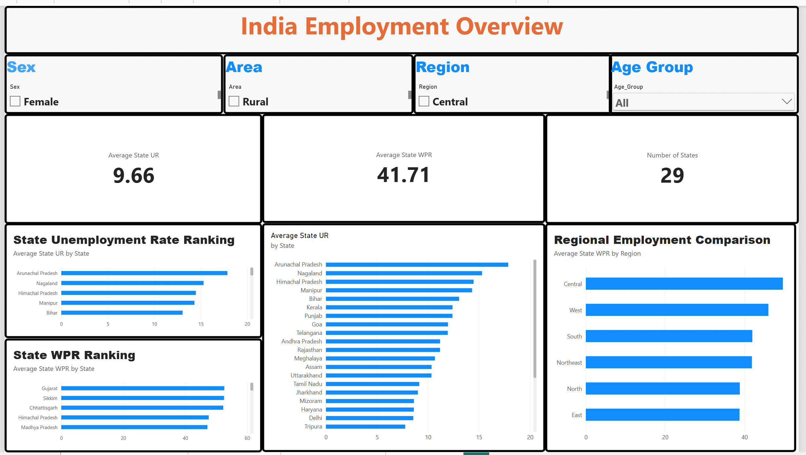
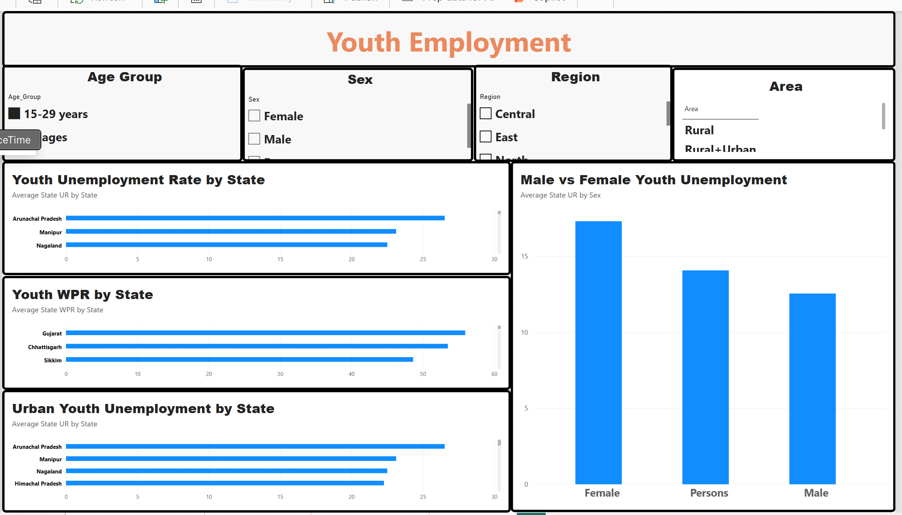
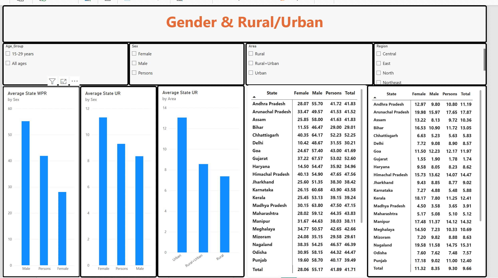
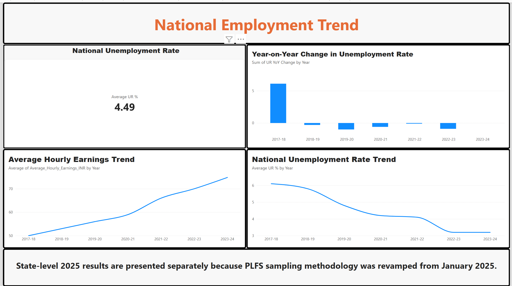

#India Employment & Labour Market Analytics

## Project Overview

This project analyses employment and unemployment patterns across India using publicly available labour-market data from the **Periodic Labour Force Survey (PLFS)** published by the **Ministry of Statistics and Programme Implementation (MoSPI), Government of India**.

The purpose of this project was to understand how unemployment and employment participation differ across:

- Indian states
- Youth and all-age population groups
- Male and female populations
- Rural and urban areas
- Different regions of India

I completed the project using **Excel, MySQL, Python and Power BI**.
---

##Project Objective

The main question I wanted to answer was:

> **How do unemployment and employment participation differ across Indian states, youth, gender, and rural/urban populations?**

The analysis also focuses on identifying:

- States with relatively high unemployment
- States with relatively high Worker Population Ratio
- Youth unemployment patterns
- Male-female employment differences
- Rural-urban unemployment differences
- Regional labour-market differences
- Long-term unemployment trends in India

---

##About the Data

The project mainly uses two datasets.

### 1. State Labour Market Data — 2025

The state-level dataset contains labour-market indicators for different combinations of:

- State
- Region
- Age group
- Rural / Urban area
- Sex

The main indicators are:

**Unemployment Rate (UR)**  
The percentage of people in the labour force who are unemployed.

**Worker Population Ratio (WPR)**  
The percentage of the population that is employed.

The main columns include:

```text
Year
State
Region
Age_Group
Area
Sex
Unemployment_Rate_Pct
Worker_Population_Ratio_Pct
```

The dataset contains **522 state-level observations** covering **29 state/UT entries** across different demographic groups.

---

### 2. National Employment Trend

A separate dataset was used to analyse the historical national trend from **2017-18 to 2023-24**.

It contains:

```text
Year
Unemployment_Rate_Pct
Average_Hourly_Earnings_INR
```

The historical national trend and 2025 state-level analysis are kept separate because the PLFS sampling methodology was revised from January 2025.

---

#Project Workflow

```text
Public PLFS Data
        ↓
Data Understanding
        ↓
Excel Data Validation
        ↓
Excel PivotTable Analysis
        ↓
SQL Analysis
        ↓
Python EDA
        ↓
Power BI Dashboard
        ↓
Key Insights
        ↓
Final Project Documentation
```

---

#Excel Analysis

I started the project in Excel to understand the structure and quality of the data.

### Data Quality Checks

I checked for:

- Duplicate records
- Missing state names
- Missing age groups
- Missing unemployment values
- Missing WPR values
- Invalid percentages below 0
- Invalid percentages above 100
- Inconsistent values in categorical columns

I also checked the unique values of:

```text
Age_Group
Area
Sex
Region
```

to make sure categories were consistent.

### PivotTable Analysis

I created PivotTables for:

- Unemployment Rate by State
- Worker Population Ratio by State
- Youth Unemployment by State
- Rural vs Urban Unemployment
- Male vs Female WPR
- Regional Employment Comparison
- National Unemployment Trend

This provided the first overview of the major patterns before moving to SQL and Python.

---

#SQL Analysis

After the initial Excel analysis, I imported the cleaned data into **MySQL**.

I created a database:

```sql
CREATE DATABASE india_employment_analysis;
```

The SQL analysis was divided into different business questions.

### State Analysis

I used SQL to rank states based on:

- Unemployment Rate
- Worker Population Ratio
- Youth Unemployment

### Youth vs Overall Unemployment

I used **CTEs and joins** to compare youth unemployment with overall unemployment for each state.

The analysis calculated:

```text
Youth Unemployment Rate
-
Overall Unemployment Rate
=
Youth Unemployment Gap
```

### SQL Concepts Used

```text
SELECT
WHERE
GROUP BY
ORDER BY
CASE WHEN
JOIN
CTE
AVG
MAX
COUNT
LAG
Window Functions
```

---

# Python Exploratory Data Analysis

Python was used for deeper analysis after completing the structured SQL queries.

Libraries used:

```python
import pandas as pd
import numpy as np
import matplotlib.pyplot as plt
```

### State Unemployment Analysis

I ranked states by unemployment rate and created visualisations for states with relatively high unemployment.

### Youth Unemployment Analysis

I created separate datasets for:

```text
All Ages
15-29 Years
```

### UR vs WPR Analysis

I also compared:

```text
Worker Population Ratio
vs
Unemployment Rate
```

to understand why unemployment rate should not always be interpreted in isolation.

### National Trend Analysis

Python was also used to visualise the historical unemployment trend from 2017-18 to 2023-24.

---

#Power BI Dashboard

The final Power BI report contains **four dashboard pages**.

---

# India Employment Overview

This page provides an overall view of state-level employment conditions.

### Main KPIs

- Average State Unemployment Rate
- Average State Worker Population Ratio
- Number of States

### Visuals

- State Unemployment Rate Ranking
- State WPR Ranking
- State Unemployment Comparison
- Regional Employment Comparison

### Filters

Users can filter the dashboard by:

```text
Sex
Area
Region
Age Group
```



---

# Youth Employment

This page focuses specifically on people aged **15-29 years**.

The purpose was to understand whether younger workers face different employment conditions compared with the wider population.

### Visuals

- Youth Unemployment Rate by State
- Youth WPR by State
- Urban Youth Unemployment by State
- Male vs Female Youth Unemployment

The dashboard shows that youth unemployment is considerably higher in some states.

Among the states visible at the top of the youth unemployment ranking are:

- Arunachal Pradesh
- Manipur
- Nagaland

States showing relatively high youth WPR include:

- Gujarat
- Chhattisgarh
- Sikkim

The gender comparison also shows that average female youth unemployment is higher than male youth unemployment in the analysed data.



---

# Gender & Rural/Urban Analysis

This page focuses on differences by gender and place of residence.

### Main Comparisons

- Male vs Female WPR
- Male vs Female Unemployment Rate
- Rural vs Urban Unemployment
- State-level gender comparisons

### Key Dashboard Results

The dashboard shows:

```text
Average State WPR

Male       ≈ 55.17
Persons    ≈ 41.89
Female     ≈ 28.06
```

This indicates a substantial difference between male and female employment participation in the analysed state-level observations.

Average state unemployment also differs by gender:

```text
Female     ≈ 11.32
Persons    ≈ 9.30
Male       ≈ 8.35
```

The dashboard also indicates that average urban unemployment is higher than rural unemployment across the observations included in the analysis.



---

#National Employment Trend

This page focuses on the historical national trend from **2017-18 to 2023-24**.

### Visuals

- National Unemployment Rate
- National Unemployment Rate Trend
- Year-on-Year Change in Unemployment
- Average Hourly Earnings Trend

The historical data shows a clear decline in the unemployment rate over the analysed period.

The unemployment rate decreased from approximately:

```text
6.1% in 2017-18
```

to approximately:

```text
3.2% in 2023-24
```

The average unemployment rate across the historical period shown in the dashboard is approximately:

```text
4.49%
```

At the same time, average hourly earnings in the provided series increased from roughly:

```text
₹50
```

in 2017-18 to around:

```text
₹75
```

in 2023-24.



---

# 💡 Key Findings

Based on the Excel, SQL, Python and Power BI analysis, the following patterns were observed.

### 1. Large Differences Exist Between States

Employment conditions are not uniform across India.

States such as **Arunachal Pradesh, Nagaland, Himachal Pradesh and Manipur** appear near the higher end of the unemployment ranking in the dashboard.

At the same time, states such as **Gujarat and Chhattisgarh** appear near the higher end of the Worker Population Ratio ranking.

This shows why national averages alone cannot explain state-level labour-market conditions.

---

### 2. Youth Unemployment Is an Important Challenge

The analysis shows that unemployment among people aged **15-29 years** is considerably higher in several states.

Arunachal Pradesh, Manipur and Nagaland appear among the states with the highest youth unemployment in the dashboard.

This suggests that analysing young workers separately is important because the overall unemployment rate can hide challenges faced by people entering the labour market.

---


### 5. Urban Unemployment Is Higher Than Rural Unemployment

The rural-urban comparison indicates that unemployment is generally higher in urban observations than in rural observations.

This shows that employment conditions can differ significantly depending on location.

---

### 6. Regional Employment Conditions Differ

The regional comparison shows noticeable differences in average state WPR.

In the dashboard:

- Central India shows one of the highest average state WPR values.
- West also performs relatively strongly.
- North and East show comparatively lower values.

These figures are averages of the included state estimates and should not be treated as official population-weighted regional employment rates.

---

### 7. National Unemployment Declined Over the Historical Period

The national trend shows unemployment declining from approximately **6.1% in 2017-18 to around 3.2% in 2023-24**.

---

### 8. Unemployment Rate Should Not Be Analysed Alone

One of the most important lessons from this project was that unemployment rate alone does not provide a complete picture of the labour market.

Worker Population Ratio also matters because it tells us how much of the population is actually employed.

For this reason, I analysed **UR and WPR together** instead of using unemployment rate alone to judge employment conditions.

---

# Important Data Limitations

This project uses published aggregate labour-market data and therefore has some limitations.

### 1. Aggregate Data

The dataset contains state-level published estimates rather than individual-level survey microdata.

Therefore, the project is suitable for:

```text
Trend analysis
State comparisons
Demographic comparisons
Data visualisation
```

but not for identifying individual-level causes of unemployment.

### 2. Correlation Is Not Causation

The analysis identifies patterns and differences.

It does not prove that factors such as:

```text
gender
location
age
region
```

cause unemployment.

Further economic and policy research would be required to establish causal relationships.

### 3. 2025 Methodology Change

State-level 2025 results are analysed separately from the historical national series because the PLFS sampling methodology was revised from January 2025.

Therefore, I did not directly combine the 2025 state-level estimates with the older national trend as if they were one perfectly continuous series.

### 4. Regional Averages

Regional values shown in this project are simple averages of the state-level estimates included in each region.

They are **not official population-weighted regional unemployment or WPR estimates**.

---

# 📁 Repository Structure

```text
India-Employment-Labour-Market-Analytics/
│
├── README.md
│
├── 01_Data/
│           india_employment_labour_market_real_data.xlsx
│
├── 02_Excel/
│           india_employment_labourMarket_ExcelWork_.xlsx
│
├── 03_SQL/
        India_Employment_Analysis.sql
│
├── 04_Python/
│            India_Unemplyment_Analysis.ipynb
│
├── 05_PowerBI/
│           india_employment_dashboard.pbix
│
├── 06_Insights/
│           key_insights.md
│
└── 07_Images/
           India_EmploymentOverview.png
           Gender&Rural:Urban.png
           National_emplymentTrend.png
           Youth_Employment.png
```

---

#Data Source

The project uses publicly available labour-market data published by the:

**Ministry of Statistics and Programme Implementation (MoSPI), Government of India**

through the:

**Periodic Labour Force Survey (PLFS)**.

Source information and methodology notes are also documented in the project's original dataset.

---

#Conclusion

This project gave me practical experience working with **real public-sector data** rather than only synthetic business datasets.

Using Excel, SQL, Python and Power BI, I was able to analyse employment conditions from different perspectives including:

```text
States
Youth
Gender
Rural vs Urban
Regions
National Trends
```

The project also helped me understand an important analytical principle:

> **A single KPI should not always be interpreted in isolation.**

For labour-market analysis, unemployment rate becomes more meaningful when it is studied together with employment participation indicators such as Worker Population Ratio.

---

# Author

**Shivani Mittal**
